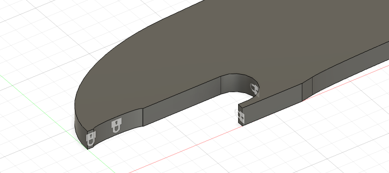

#Rapporto Studio - cavatappi

##Progetto

<video width="800" controls>
  <source src="video/rendering.mp4" type="video/mp4">
</video>

Spessore: 6.00 mm

Materiale: **Acciaio**

<table>
<tr><th>Densità</th><td>7.85E-06 kg / mm3</td></tr>
<tr><th>Modulo di Young</th><td>210000 MPa</td></tr>
<tr><th>Coefficiente di Poisson</th><td>0.3</td></tr>
<tr><th>Resistenza allo snervamento</th><td>207 MPa</td></tr>
<tr><th>Resistenza massima a trazione</th><td>345 MPa</td></tr>
<tr><th>Conducibilità termica</th><td>0.056 W / (mm C)</td></tr>
<tr><th>Coefficiente di dilatazione termica</th><td>1.2E-05 / C</td></tr>
<tr><th>Calore specifico</th><td>480 J / (kg C)</td></tr>
</table>

##Analisi statica

###Condizioni di carico

Forza applicata: **100.00 N**

Vincoli: 

---

###Deformazione

<video width="800" controls>
  <source src="video/deformazione.mov" type="video/mp4">
</video>

---

###Sollecitazione
####Fattore di sicurezza 

<video width="800" controls>
  <source src="video/condizioneDiCarico1.mov" type="video/mp4">
</video>

--

####Von Mises

<video width="800" controls>
  <source src="video/sollecitazione-vonMises.mov" type="video/mp4">
</video>

---

###Forze di reazione 

<video width="800" controls>
  <source src="video/forzeDiReazione.mov" type="video/mp4">
</video>

---

###Spostamento 

<video width="800" controls>
  <source src="video/spostamento.mov" type="video/mp4">
</video>

---

##Analisi di generative-design

###Impostazioni di simulazione

<table>
<tr><th>Massa</th><td> <= 50% </td></tr>
<tr><th>Materiale</th><td>Acciaio</td></tr>
</table>

Aree mantenute:

---

###Condizioni di carico

Forza applicata: **100.00 N**

Vincoli: 

---

###Ottimizzazione delle forme

<video width="800" controls>
  <source src="video/ottimizzazioneDelleForme.mov" type="video/mp4">
</video>

---