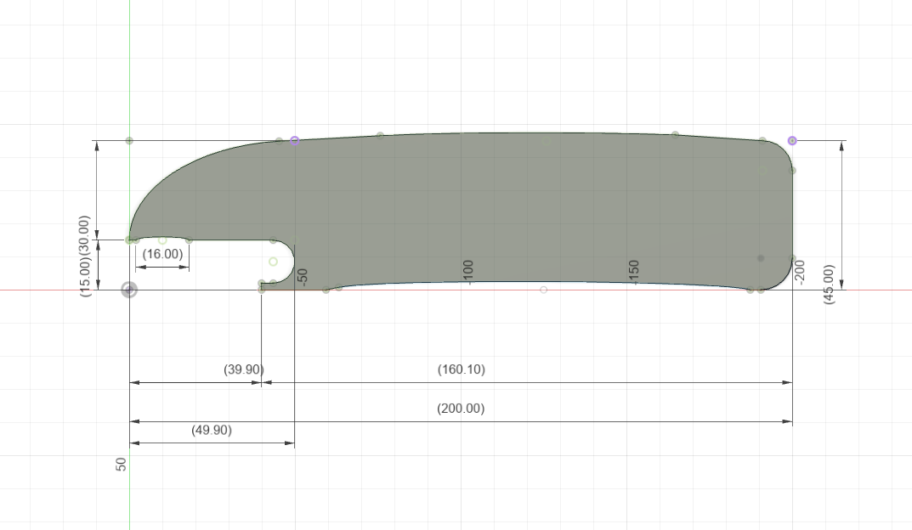
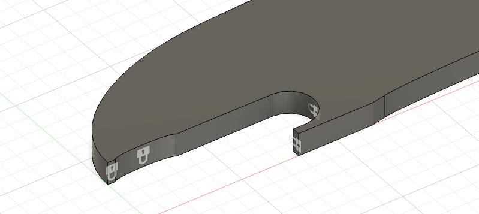
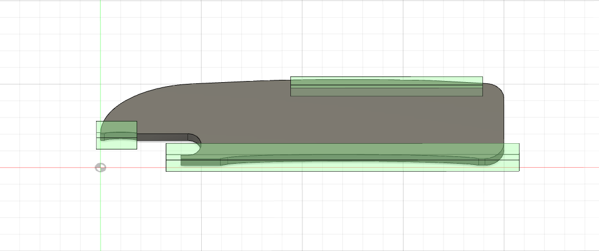

<h1 id="toc_0">Rapporto Studio - cavatappi</h1>

<h2 id="toc_1">Progetto</h2>

<video width="800" controls>
  <source src="video/rendering.mp4" type="video/mp4">
</video>

Spessore: 6.00 mm

Materiale: <strong>Acciaio</strong>

<table>
<tr><th>Densità</th><td>7.85E-06 kg / mm3</td></tr>
<tr><th>Modulo di Young</th><td>210000 MPa</td></tr>
<tr><th>Coefficiente di Poisson</th><td>0.3</td></tr>
<tr><th>Resistenza allo snervamento</th><td>207 MPa</td></tr>
<tr><th>Resistenza massima a trazione</th><td>345 MPa</td></tr>
<tr><th>Conducibilità termica</th><td>0.056 W / (mm C)</td></tr>
<tr><th>Coefficiente di dilatazione termica</th><td>1.2E-05 / C</td></tr>
<tr><th>Calore specifico</th><td>480 J / (kg C)</td></tr>
</table>

<h2 id="toc_2">Analisi statica</h2>

<h3 id="toc_3">Condizioni di carico</h3>

Forza applicata: <strong>100.00 N</strong>

Vincoli: 

<h3 id="toc_4">Deformazione</h3>

<video width="800" controls>
  <source src="video/deformazione.mov" type="video/mp4">
</video>

<h3 id="toc_5">Sollecitazione</h3>

<h4 id="toc_6">Fattore di sicurezza</h4>

<video width="800" controls>
  <source src="video/condizioneDiCarico1.mov" type="video/mp4">
</video>

<h2 id="toc_7"></h2>

<h4 id="toc_8">Von Mises</h4>

<video width="800" controls>
  <source src="video/sollecitazione-vonMises.mov" type="video/mp4">
</video>

<h3 id="toc_9">Forze di reazione</h3>

<video width="800" controls>
  <source src="video/forzeDiReazione.mov" type="video/mp4">
</video>

<h3 id="toc_10">Spostamento</h3>

<video width="800" controls>
  <source src="video/spostamento.mov" type="video/mp4">
</video>

<h2 id="toc_11">Analisi di generative-design</h2>

<h3 id="toc_12">Impostazioni di simulazione</h3>

<table>
<tr><th>Massa</th><td> <= 50% </td></tr>
<tr><th>Materiale</th><td>Acciaio</td></tr>
</table>

Aree mantenute:

<h3 id="toc_13">Condizioni di carico</h3>

Forza applicata: <strong>100.00 N</strong>

Vincoli: 

<h3 id="toc_14">Ottimizzazione delle forme</h3>

<video width="800" controls>
  <source src="video/ottimizzazioneDelleForme.mov" type="video/mp4">
</video>

